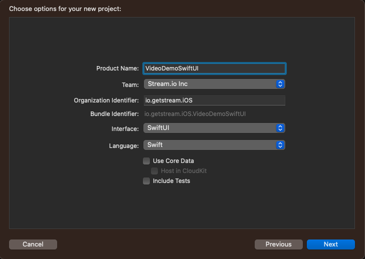
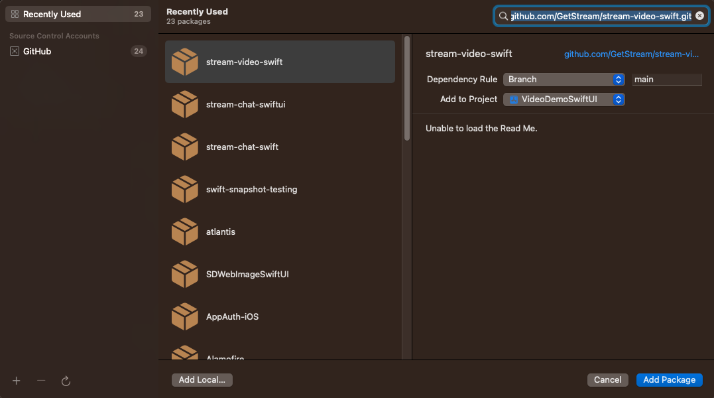
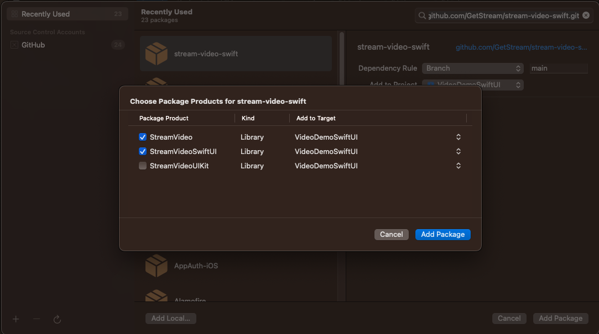
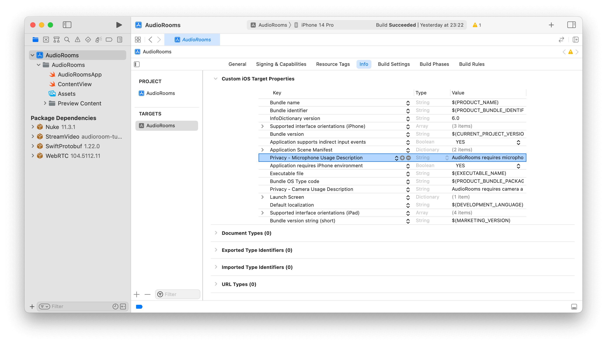

### Creating a project

To get started with the `StreamVideo` SDK, open Xcode and create a new project.

- Create a new Swift project in Xcode 14
- Choose iOS from the list of platforms
- Choose the "App" template
- Use VideoDemoSwiftUI for the project name
- Select "SwiftUI" in the Interface option

We are going to use the Swift Package Manager to fetch the SDK.

- In Xcode, go to File -> "Add Packages..."
- Paste the URL https://github.com/GetStream/stream-video-swift.git
- In the option "Dependency Rule" choose "Branch", in the single text input next to it, enter "main"

- Choose "Add Package" and wait for the dialog to complete.
- Select `StreamVideo` and `StreamVideoSwiftUI` (if you use SwiftUI, otherwise also select `StreamVideoUIKit`).

### Permissions

Making a video call requires the usage of the camera and the microphone of the device. Therefore, you need to request permissions to use them in your app. In order to do this, you will need to add the following keys and values in your `Info.plist` file.

`Privacy - Camera Usage Description` - "Your_app_name requires camera access in order to capture and transmit video"
`Privacy - Microphone Usage Description` - "Your_app_name requires microphone access in order to capture and transmit audio"

Note that you should replace "Your_app_name" (or also use your custom strings instead).

With this, you should be able to test a video call between two devices. Note that you need to specify the participants list in the `startCall` method. Also, the call id should be the same on the different devices that are part of the call.
