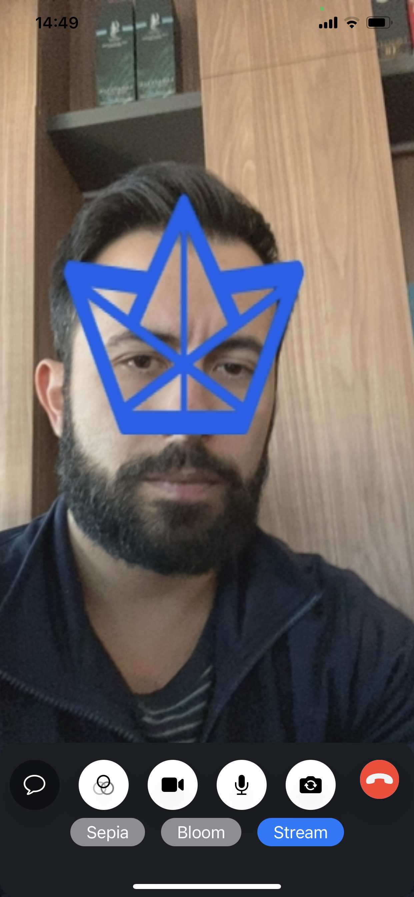

### Introduction

Some calling apps allow filters to be applied to the current user's video, such as blurring the background, adding AR elements (glasses, moustaches, etc) or applying image filters (such as sepia, bloom etc). StreamVideo's iOS SDK has support for injecting your custom filters into the calling experience.

If you initialized the SDK with custom filters support and the user selected a filter, you will receive each frame of the user's local video as `CIImage`, allowing you to apply the filters.

You can find a working example of the filters in our `VideoWithChat` sample project [here](https://github.com/GetStream/stream-video-ios-examples/tree/main/VideoWithChat).

### VideoFilter

The `VideoFilter` class allows you to create your own filters. It contains the id and name of the filter, along with an async function that converts the original `CIImage` to an output `CIImage`. If no filter is selected, the same input image is returned.

For example, let's add a simple "Sepia" filter, from the default ones by Apple:

```swift
static let sepia: VideoFilter = {
    let sepia = VideoFilter(id: "sepia", name: "Sepia") { image in
        let sepiaFilter = CIFilter(name: "CISepiaTone")
        sepiaFilter?.setValue(image, forKey: kCIInputImageKey)
        return sepiaFilter?.outputImage ?? image
    }
    return sepia
}()
```

We can create a helper `FilterService`, that will keep the available filters, as well as some state information about the selected filter and whether the filters picker is shown:

```swift
class FiltersService: ObservableObject {
    @Published var filtersShown = false
    @Published var selectedFilter: VideoFilter?
    
    static let supportedFilters = [sepia]
}
```

Next, we need to pass the supported filters to the `StreamVideo` object, via its `VideoConfig`:

```swift
let streamVideo = StreamVideo(
    apiKey: apiKey,
    user: userCredentials.user,
    token: token,
    videoConfig: VideoConfig(
        joinVideoCallInstantly: true,
        videoFilters: FiltersService.supportedFilters
    ),
    tokenProvider: { result in
        tokenProvider { tokenResult in
            switch tokenResult {
            case .success(let rawValue):
                do {
                    let updatedToken = try UserToken(rawValue: rawValue)
                    result(.success(updatedToken))
                } catch {
                    result(.failure(error))
                }
            case .failure(let error):
                result(.failure(error))
            }
        }
    }
)
```

Now, let's enable the filter selection in the user interface. One option is to include the filters in the call controls shown at the bottom of the call view. In this section, only the filters relevant parts are added, see the full code [here](https://github.com/GetStream/stream-video-ios-examples/blob/main/VideoWithChat/VideoWithChat/Sources/ChatCallControls.swift): 


```swift
public var body: some View {
        VStack {
            EqualSpacingHStack(views: [                
                /// removed not relevant code
                AnyView(
                    Button(
                        action: {
                            withAnimation {
                                filtersService.filtersShown.toggle()
                            }
                        },
                        label: {
                            CallIconView(
                                icon: Image(systemName: "camera.filters"),
                                size: size,
                                iconStyle: filtersService.filtersShown ? .primary : .transparent
                            )
                        }
                    ))
                    /// removed not relevant code
            ])            
            
            if filtersService.filtersShown {
                HStack(spacing: 16) {
                    ForEach(FiltersService.supportedFilters) { filter in
                        Button {
                            withAnimation {
                                if filtersService.selectedFilter == filter {
                                    filtersService.selectedFilter = nil
                                } else {
                                    filtersService.selectedFilter = filter
                                }
                                viewModel.setVideoFilter(filtersService.selectedFilter)
                            }
                        } label: {
                            Text(filter.name)
                                .padding(.horizontal)
                                .padding(.vertical, 4)
                                .background(filtersService.selectedFilter == filter ? Color.blue : Color.gray)
                                .foregroundColor(.white)
                                .cornerRadius(16)
                        }

                    }
                }
            }
        }
        .frame(maxWidth: .infinity)
        .frame(height: chatHelper.chatShown ? chatHeight + 120 : 120)
        .background(
            colors.callControlsBackground
                .cornerRadius(16)
                .edgesIgnoringSafeArea(.all)
        )
    }
```

First, we're adding the icon for the filters, that will control the `filtersShown` state. Next, whenever the `filtersShown` is true, we're showing the list of the available filters. When a user selects a filter, we're calling the `CallViewModel`'s method `setVideoFilter`. This will enable the video filter for the ongoing call.

That is everything that is needed for a basic video filter support.

### Adding AI Filters

In some cases, you might also want to apply AI filters, whether that is some addition to the user's face (glasses, moustaches, etc), or an ML filter. In this section we will cover this case, where we will show Stream's logo over the user's face. Whenever the user moves along, we will update the logo's location.

To do this, we will use the Vision framework and the `VNDetectFaceRectanglesRequest`. First, let's create the method that will detect the faces:

```swift
static func detectFaces(image: CIImage) async throws -> CGRect {
    return try await withCheckedThrowingContinuation { continuation in
        let detectFaceRequest = VNDetectFaceRectanglesRequest { (request, error) in
            if let result = request.results?.first as? VNFaceObservation {
                continuation.resume(returning: result.boundingBox)
            } else {
                continuation.resume(throwing: ClientError.Unknown())
            }
        }
        let vnImage = VNImageRequestHandler(ciImage: image, orientation: .downMirrored)
        try? vnImage.perform([detectFaceRequest])
    }
}
```

Next, let's add some helper methods, that will allow conversion between `CIImage` and `UIImage`, as well as the possibility to draw over an image:

```swift
static func convert(cmage: CIImage) -> UIImage {
    let context = CIContext(options: nil)
    let cgImage = context.createCGImage(cmage, from: cmage.extent)!
    let image = UIImage(cgImage: cgImage, scale: scale, orientation: .up)
    return image
}

@MainActor
static func drawImageIn(_ image: UIImage, size: CGSize, _ logo: UIImage, inRect: CGRect) -> UIImage {
    let format = UIGraphicsImageRendererFormat()
    format.scale = 1
    format.opaque = true
    let renderer = UIGraphicsImageRenderer(size: size, format: format)
    return renderer.image { context in
        image.draw(in: CGRect(origin: CGPoint.zero, size: size))
        logo.draw(in: inRect)
    }
}
```

With those two in place, we can now implement our custom AI filter:

```swift
static let stream: VideoFilter = {
    let stream = VideoFilter(id: "stream", name: "Stream") { image in
        guard let faceRect = try? await detectFaces(image: image) else { return image }
        let converted = convert(cmage: image)
        let bounds = image.extent
        let convertedRect = CGRect(
            x: faceRect.minX * bounds.width - 80,
            y: faceRect.minY * bounds.height,
            width: faceRect.width * bounds.width,
            height: faceRect.height * bounds.height
        )
        let overlayed = await drawImageIn(converted, size: bounds.size, streamLogo, inRect: convertedRect)
        
        let result = CIImage(cgImage: overlayed.cgImage!)
        return result
    }
    return stream
}()
```

First, we are detecting the face rectangle using the `detectFaces` method we defined earlier and we convert the `CIImage` to `UIImage`. Next, we convert the rectangle to the real screen dimensions (since it returns percentages). We are passing this information to the `drawImageIn` method, that adds the logo at the `convertedRect` frame. At the end, we convert back the image to `CIImage` and return the result.

Also, don't forget to add the `stream` filter in the supported filters method:

```swift
static let supportedFilters = [sepia, stream]
```

The end result should look like this:

